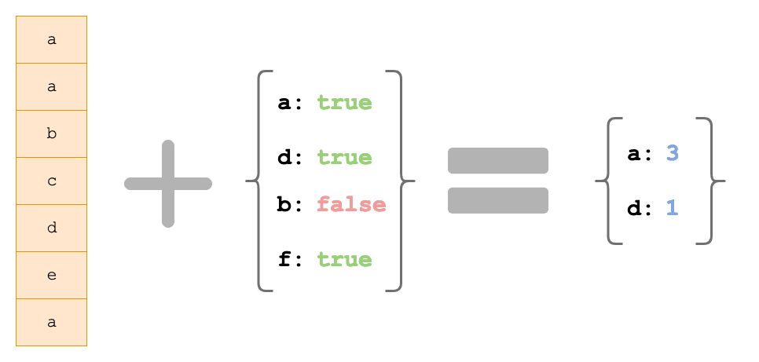

## Challenge

- `countOnly` will be given an array and an object. It will return an object containing counts of everything that the input object listed.



## Solution

```javascript
const countOnly = function (allItems, itemsToCount) {
  const results = {};

  for (const item of allItems) {
    if (itemsToCount[item]) {
      if (results[item]) {
        results[item] += 1;
      } else {
        results[item] = 1;
      }
    }
  }

  return results;
};
```

## Explanation

- The `countOnly` function counts certain strings in an array of strings taking 2 arguments:

  1. `allItems`: the array that will be counted.
  2. `itemsToCount`: an object that says which strings to count. Keys in the object represent the strings that need to be counted. Their values are either `true` or `false`. If the value is `true`, the matching string should be counted. When the value is `false`, the matching string should be ignored.

- We create an empty object named `results` to store the count of each string.
- We loop through `allItems` and check if the current string `item` should be counted.
- If it will be counted it checks to see of the string is already in the `results`.
- If the count is already in the `results` object, we will set the count to 1.
- Lastly we return the `results` object containing the count of every string that should have been counted.

## Test Cases

```javascript
const firstNames = [
  "Karl",
  "Salima",
  "Agouhanna",
  "Fang",
  "Kavith",
  "Jason",
  "Salima",
  "Fang",
  "Joe",
];

const result1 = countOnly(firstNames, {
  Jason: true,
  Karima: true,
  Fang: true,
  Agouhanna: false,
});

assertEqual(result1["Jason"], 1);
// output: ✅ Assertion Passed: [1] === [1]

assertEqual(result1["Karima"], undefined);
// output: ✅ Assertion Passed: [undefined] === [undefined]

assertEqual(result1["Fang"], 2);
// output: ✅ Assertion Passed: [2] === [2]

assertEqual(result1["Agouhanna"], undefined);
// output: ✅ Assertion Passed: [undefined] === [undefined]
```
